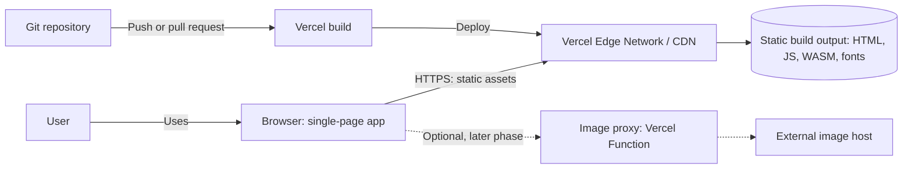
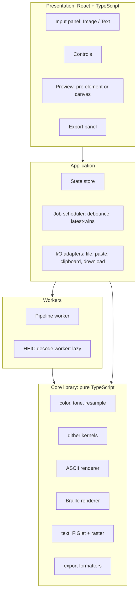
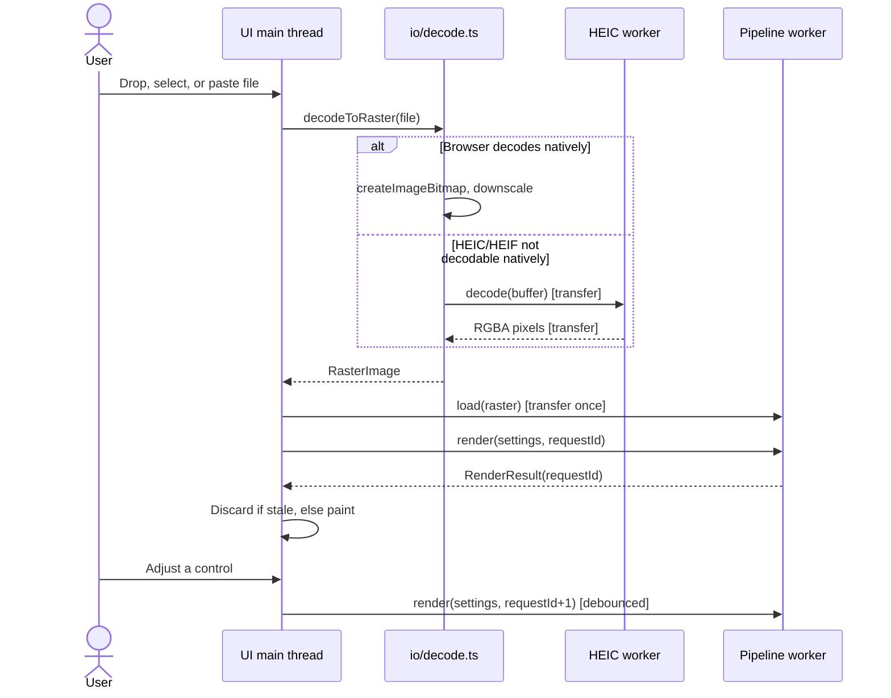

# Architecture

System design for the ASCII & Braille Art Generator: how the pieces fit, how work is scheduled, and why the main decisions were made.

## Contents

- [Principles](#principles)
- [System context](#system-context)
- [Logical architecture](#logical-architecture)
- [Technology stack](#technology-stack)
- [Repository layout](#repository-layout)
- [Runtime and threading](#runtime-and-threading)
- [Data model](#data-model)
- [Error handling](#error-handling)
- [Extending the app](#extending-the-app)
- [Decision log](#decision-log)

## Principles

1. **Client-only compute.** Decoding, conversion, and export all run in the browser. Vercel serves static files.
2. **Pure core, thin shell.** Algorithms live in `src/core/` with no DOM or framework dependency. UI, workers, and I/O adapters wrap them.
3. **Off the main thread.** Heavy work runs in Web Workers so controls stay responsive.
4. **Lazy loading.** The HEIC decoder, FIGlet fonts, and export helpers load only when used.
5. **Deterministic output.** The same input and settings always produce the same text. This makes snapshot testing possible.

## System context



There is no application server in v1. The only optional server piece is the URL-image proxy described in [deployment.md](deployment.md#optional-image-proxy).

## Logical architecture



| Layer | Responsibility | May depend on |
|---|---|---|
| Presentation | Rendering UI, capturing input | Application |
| Application | State, scheduling, browser API adapters | Workers, Core |
| Workers | Off-thread decode and conversion | Core |
| Core | All algorithms | Nothing outside itself |

Dependencies point downward only. `core` never imports from `ui`, `state`, `io`, or `workers`.

## Technology stack

| Concern | Choice | Why |
|---|---|---|
| Language | TypeScript, strict mode | Typed pixel buffers and settings |
| Build | Vite | Fast dev loop, built-in worker and WASM support, Vercel preset |
| UI | React | Many interdependent controls |
| Styling | CSS Modules | Scoped, no runtime cost |
| HEIC | `libheif-js` in a worker | Raw RGBA output, no JPEG round-trip |
| FIGlet | `figlet`, fonts fetched on demand | Large font catalog without bloating the bundle |
| Unit tests | Vitest | Fast, TypeScript-native |
| E2E tests | Playwright | Chromium, Firefox, and WebKit |
| Hosting and CI | Vercel, GitHub Actions | Preview deployments per pull request |

## Repository layout

```text
.
├─ public/
│  └─ fonts/
│     ├─ figlet/                 # *.flf fonts, lazy-loaded
│     ├─ figlet-fonts.json       # name, category, file, size
│     └─ ui/                     # self-hosted fonts for raster text
├─ src/
│  ├─ app/                       # Shell, routes, providers
│  ├─ ui/                        # InputPanel, Controls, Preview, ExportPanel
│  ├─ state/                     # Settings store, persistence
│  ├─ workers/
│  │  ├─ pipeline.worker.ts
│  │  └─ heic.worker.ts
│  ├─ io/                        # decode.ts, sniff.ts, clipboard.ts, download.ts
│  ├─ core/
│  │  ├─ color.ts
│  │  ├─ resample.ts
│  │  ├─ tone.ts
│  │  ├─ dither/                 # kernels.ts, errorDiffusion.ts, ordered.ts
│  │  ├─ ascii/                  # ramp.ts, density.ts, edges.ts, render.ts
│  │  ├─ braille/                # bitmap.ts, render.ts
│  │  ├─ text/                   # figlet.ts, rasterText.ts
│  │  └─ export/                 # text.ts, fullwidth.ts, discord.ts, png.ts
│  └─ types.ts
├─ tests/
├─ docs/
└─ vercel.json
```

## Runtime and threading

| Thread | Work |
|---|---|
| **Main** | UI, state, file and clipboard access, canvas work that needs loaded fonts (text rasterization, ramp calibration, PNG export) |
| **Pipeline worker** | Holds the source image; resamples, applies tone, dithers, and renders text output |
| **HEIC worker** | Created only when native decoding fails for a HEIC/HEIF file; terminated after decoding |

**Transfer once, then send settings.** The main thread transfers the source pixel buffer to the pipeline worker a single time (`load`). Later `render` messages carry only settings, so slider changes do not re-send megabytes of pixels. The worker caches the resampled luminance grid and reuses it when only tone or dithering settings change.

**Latest-wins scheduling.** Setting changes are debounced (about 60–100 ms) and tagged with an increasing request ID. The UI applies a result only if its ID is the newest. During a slider drag, a smaller preview may render first, followed by a full-quality render when the drag ends.



## Data model

```ts
export interface RasterImage {
  width: number;
  height: number;
  data: Uint8ClampedArray; // RGBA, 8 bits per channel
}

export type Dithering =
  | { algorithm: 'none' }
  | { algorithm: 'floyd-steinberg' | 'atkinson' | 'custom'; strength: number; serpentine: boolean; kernelId?: string }
  | { algorithm: 'ordered'; matrix: 2 | 4 | 8; strength: number }
  | { algorithm: 'blue-noise'; strength: number };

export interface CommonSettings {
  columns: number;      // 20–300, default 120
  brightness: number;   // -100..100
  contrast: number;     // 0.25..3
  gamma: number;        // 0.5..2.5
  stretchX: number;     // 0.5..2
  stretchY: number;     // 0.5..2
  invert: boolean;
  dithering: Dithering;
  color: 'none' | 'source' | 'gradient';
  background: 'transparent' | 'black' | 'white';
}

export interface AsciiSettings extends CommonSettings {
  mode: 'ascii';
  ramp: string;                    // lightest to darkest
  calibrateRamp: boolean;
  cellAspect: number;              // character width / line height, default 0.5
  edge: { enabled: boolean; threshold: number };
}

export interface BrailleSettings extends CommonSettings {
  mode: 'braille';
  threshold: 'otsu' | number;
  fillBlank: boolean;              // replace U+2800 with U+2804
}

export interface RenderResult {
  text: string;                    // '\n'-separated
  cols: number;
  rows: number;
  colors?: Uint8Array;             // RGB per cell when color is on
}
```

Text-mode settings are in [text-mode.md](text-mode.md#settings).

## Error handling

Decoding and conversion errors are mapped to a small set of typed errors so the UI can show plain messages without exposing internals.

| Error code | Cause | User message |
|---|---|---|
| `unsupported-format` | Native decode failed and the file is not HEIC | "This file type isn't supported." |
| `file-too-large` | Size over limit | "This file is larger than 25 MB." |
| `image-too-large` | Pixel count over limit | "This image has too many pixels." |
| `decode-failed` | Corrupt or truncated file | "This file couldn't be read." |
| `cors-blocked` | URL host disallows cross-origin reads | "That site doesn't allow loading its images here." |
| `clipboard-denied` | Clipboard API blocked | "Couldn't copy. Use Download instead." |

Worker crashes are caught by the main thread; the worker is recreated and the last request is retried once.

## Extending the app

**Add a dither kernel.** Add an entry to `core/dither/kernels.ts` (see the `Kernel` shape in [processing.md](processing.md#dithering)), register its id, and add it to the Dithering select. Add a golden test.

**Add a ramp preset.** Add the string to `core/ascii/ramp.ts`. Presets must be ordered lightest to darkest.

**Add a FIGlet font.** Copy the `.flf` file to `public/fonts/figlet/`, add a record to `figlet-fonts.json`, and add its license to `THIRD_PARTY_NOTICES.md`.

**Add an export format.** Add a pure formatter in `core/export/` that takes a `RenderResult` and returns a string or blob, then add a button in `ExportPanel`.

## Decision log

| # | Decision | Reason | Consequence |
|---|---|---|---|
| 1 | Process everything client-side | Privacy, no server cost, instant results | Bounded by device memory; URL loading limited by CORS |
| 2 | Dither the whole Braille dot grid before packing | Error must flow across cell boundaries | Slightly more memory than per-cell thresholding |
| 3 | Quantize ASCII to measured glyph densities | Real glyph densities are not evenly spaced | Needs a calibration step per font |
| 4 | Dither in linear light | Dots and ink average in linear light | Requires sRGB conversion up front |
| 5 | HEIC: native first, `libheif-js` fallback | Skips a large download where the browser can decode | Two code paths to test |
| 6 | Use `libheif-js` directly, not a converter | Raw pixels, no lossy re-encode | Slightly more integration code |
| 7 | Rasterize text on the main thread | Fonts are loaded there | Small buffer transfer to the worker |
| 8 | Transfer pixels once; send only settings afterward | Avoids copying megabytes per slider tick | Worker holds state; needs explicit `load` |
| 9 | Latest-wins request IDs | Prevents stale results overwriting newer ones | Small amount of scheduling code |
| 10 | No third-party scripts | Tight CSP, privacy | Analytics, if wanted, must be same-origin |
