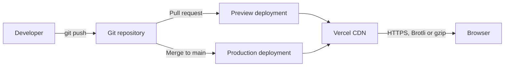

# Deployment

How to build and host the app on Vercel.

## Contents

- [Overview](#overview)
- [First deployment](#first-deployment)
- [Project settings](#project-settings)
- [vercel.json](#verceljson)
- [Security headers](#security-headers)
- [Caching](#caching)
- [CI](#ci)
- [Releases and rollback](#releases-and-rollback)
- [Optional analytics](#optional-analytics)
- [Optional image proxy](#optional-image-proxy)
- [Deployment checklist](#deployment-checklist)

## Overview

The app is a static single-page site. Vercel builds it and serves the output from its CDN. There are no serverless functions, databases, or environment variables in v1.



## First deployment

**From the dashboard**

1. Push the repository to GitHub, GitLab, or Bitbucket.
2. In Vercel, choose **Add New → Project** and import the repository.
3. Confirm the settings in the next section. Vercel detects the Vite preset.
4. Click **Deploy**.

**From the command line**

```bash
npm i -g vercel
vercel          # first run links the project and creates a preview deployment
vercel --prod   # deploy to production
```

## Project settings

| Setting | Value |
|---|---|
| Framework preset | Vite |
| Install command | `npm ci` |
| Build command | `npm run build` (runs `tsc --noEmit && vite build`) |
| Output directory | `dist` |
| Node.js version | An LTS version, also set in `package.json` under `engines` |
| Environment variables | None |
| Domain | Add a custom domain under **Settings → Domains**. HTTPS certificates are issued automatically |

## vercel.json

```json
{
  "$schema": "https://openapi.vercel.sh/vercel.json",
  "framework": "vite",
  "buildCommand": "npm run build",
  "outputDirectory": "dist",
  "rewrites": [
    { "source": "/((?!api/|assets/|fonts/).*)", "destination": "/index.html" }
  ],
  "headers": [
    {
      "source": "/assets/(.*)",
      "headers": [{ "key": "Cache-Control", "value": "public, max-age=31536000, immutable" }]
    },
    {
      "source": "/fonts/(.*)",
      "headers": [{ "key": "Cache-Control", "value": "public, max-age=604800, stale-while-revalidate=86400" }]
    },
    {
      "source": "/(.*)",
      "headers": [
        { "key": "X-Content-Type-Options", "value": "nosniff" },
        { "key": "Referrer-Policy", "value": "strict-origin-when-cross-origin" },
        { "key": "Permissions-Policy", "value": "camera=(), microphone=(), geolocation=()" },
        {
          "key": "Content-Security-Policy",
          "value": "default-src 'self'; script-src 'self' 'wasm-unsafe-eval'; style-src 'self' 'unsafe-inline'; img-src 'self' blob: data:; font-src 'self'; worker-src 'self' blob:; connect-src 'self'; object-src 'none'; base-uri 'self'; frame-ancestors 'none'"
        }
      ]
    }
  ]
}
```

The rewrite sends unknown paths to `index.html` for client-side routing. Files that exist on disk (assets, fonts) are served as they are.

## Security headers

| Header | Purpose |
|---|---|
| `Content-Security-Policy` | Only same-origin scripts, styles, fonts, and workers. Blocks third-party code |
| `X-Content-Type-Options: nosniff` | Stops browsers guessing MIME types |
| `Referrer-Policy` | Limits referrer data on outbound navigation |
| `Permissions-Policy` | Disables camera, microphone, and location |

Notes on the policy:

- `'wasm-unsafe-eval'` is required for the libheif WebAssembly module to start. Test it on a preview deployment in every browser.
- `'unsafe-inline'` in `style-src` covers inline `style` attributes. Remove it later by moving dynamic styling to CSS variables and classes.
- Cross-origin isolation headers (COOP/COEP) are **not** needed because the app does not use `SharedArrayBuffer`.
- If URL loading through `fetch` is enabled, widen `connect-src` and `img-src` deliberately and only as far as needed.

## Caching

| Path | Policy | Reason |
|---|---|---|
| `/assets/*` | 1 year, `immutable` | File names include a content hash |
| `/fonts/*` | 7 days, stale-while-revalidate | Names are not hashed. Use versioned paths such as `/fonts/v1/` if you want longer caching |
| `/index.html` | Vercel default | Must revalidate so new deployments are picked up |

Vercel serves Brotli or gzip automatically.

**Bundle splitting.** Keep these as separate chunks so the first page load stays small:

- Main app
- HEIC worker (contains the WebAssembly decoder)
- FIGlet loader
- Export helpers

## CI

Run checks on every pull request. Vercel creates the preview deployment on its own.

```yaml
# .github/workflows/ci.yml
name: CI
on:
  pull_request:
  push:
    branches: [main]

jobs:
  check:
    runs-on: ubuntu-latest
    steps:
      - uses: actions/checkout@v4
      - uses: actions/setup-node@v4
        with:
          node-version: lts/*
          cache: npm
      - run: npm ci
      - run: npm run lint
      - run: npm run typecheck
      - run: npm test
      - run: npm run build
```

For browser tests against the preview URL, add a second job that waits for the Vercel deployment and runs `npm run test:e2e` with `BASE_URL` set to that URL. Configure Playwright's `baseURL` from the environment variable.

## Releases and rollback

- **Production** deploys on every merge to `main`.
- **Preview** deploys for every pull request; share the URL for review.
- **Rollback:** in the Vercel dashboard, open the previous production deployment and promote it. This is instant because deployments are immutable.

## Optional analytics

If you want traffic numbers, Vercel Web Analytics and Speed Insights are cookieless and same-origin. Do not send image or text content to any analytics or error-reporting tool. If you add one, configure it to drop user content, and update the privacy notice.

## Optional image proxy

Loading an image from a URL fails when the host does not send CORS headers: the canvas becomes tainted and pixel reads throw. A proxy on a Vercel Function can work around this, but it is the only server-side code in the project and it carries real risk (server-side request forgery). Build it only if the feature is worth that.

If you build it, it must:

- Accept only `http` and `https`.
- Resolve DNS and **block private, loopback, link-local, and cloud-metadata addresses**, including after redirects.
- Allow only `image/*` content types.
- Enforce a byte cap and a request timeout.
- Rate-limit by client.
- Return image bytes only and log no image content.
- Stay within Vercel Function request and response body limits (on the order of 4.5 MB; check the current limits), so large images may fail through the proxy.

Then update `connect-src` in the CSP and add tests for every blocked address range.

## Deployment checklist

- [ ] Vite preset detected; build passes on Vercel
- [ ] `vercel.json` committed
- [ ] Preview deployment tested in Chrome, Firefox, and Safari
- [ ] HEIC fallback works on the preview (Chromium and Firefox) under the CSP
- [ ] No console CSP violations
- [ ] Custom domain added; HTTPS works
- [ ] `THIRD_PARTY_NOTICES.md` and `LICENSE` present
- [ ] Privacy notice published
- [ ] Open Graph image, `robots.txt`, and `sitemap.xml` in place
