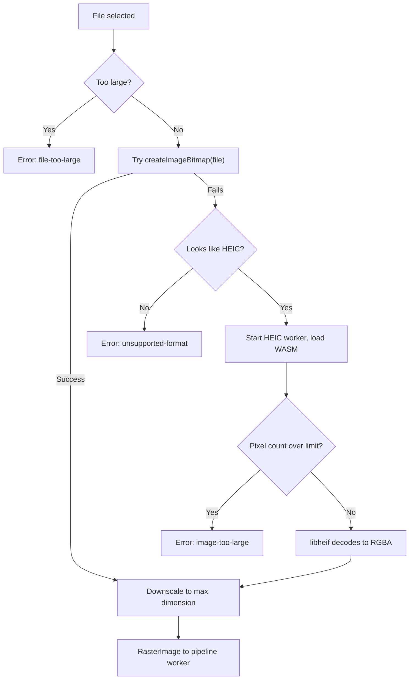

# HEIC / HEIF Support

How the app reads HEIC and HEIF images, the format iPhones use for photos.

## Contents

- [Summary](#summary)
- [Detection](#detection)
- [Decoding flow](#decoding-flow)
- [Implementation](#implementation)
- [Limits](#limits)
- [Edge cases](#edge-cases)
- [Bundling and CSP](#bundling-and-csp)
- [Licensing](#licensing)
- [Testing](#testing)
- [Alternatives considered](#alternatives-considered)

## Summary

Safari and some system configurations can decode HEIC natively. Chrome and Firefox generally cannot. The app therefore:

1. Detects HEIC/HEIF files.
2. Tries the browser's own decoder first.
3. If that fails, loads a WebAssembly build of libheif (`libheif-js`) in a worker and decodes to raw RGBA pixels.

The WebAssembly code is downloaded only when it is needed.

## Detection

A file is treated as HEIC/HEIF if **any** of these is true:

- The extension is `.heic` or `.heif`.
- The MIME type is `image/heic` or `image/heif`.
- Bytes 4–7 are `ftyp` and bytes 8–11 are a known HEIF brand.

The extension and signature checks matter because some browsers report an empty MIME type for HEIC files. The file picker must list the extensions explicitly: `accept="image/*,.heic,.heif"`.

```ts
// src/io/sniff.ts
const HEIF_BRANDS = ['heic', 'heix', 'hevc', 'hevx', 'heim', 'heis', 'mif1', 'msf1'];

export function looksLikeHeic(head: Uint8Array, name: string, mime: string): boolean {
  if (/\.(heic|heif)$/i.test(name) || /^image\/hei[cf]$/i.test(mime)) return true;
  if (head.length < 12) return false;
  const box = String.fromCharCode(...head.subarray(4, 8));
  const brand = String.fromCharCode(...head.subarray(8, 12));
  // mif1 and msf1 can also denote AVIF; native decoding is tried first, so this is safe.
  return box === 'ftyp' && HEIF_BRANDS.includes(brand);
}
```

## Decoding flow



## Implementation

### Main-thread decoder

```ts
// src/io/decode.ts
export async function decodeToRaster(file: File, maxDim = 4096): Promise<RasterImage> {
  if (file.size > MAX_FILE_BYTES) throw new DecodeError('file-too-large');

  const head = new Uint8Array(await file.slice(0, 16).arrayBuffer());
  const heic = looksLikeHeic(head, file.name, file.type);

  try {
    const bmp = await createImageBitmap(file, { imageOrientation: 'from-image' });
    return bitmapToRaster(bmp, maxDim);
  } catch (nativeError) {
    if (!heic) throw new DecodeError('unsupported-format', nativeError);
  }

  const raw = await heicClient.decode(await file.arrayBuffer()); // lazy worker
  return downscaleRaster(raw, maxDim);
}

function bitmapToRaster(bmp: ImageBitmap, maxDim: number): RasterImage {
  const s = Math.min(1, maxDim / Math.max(bmp.width, bmp.height));
  const w = Math.max(1, Math.round(bmp.width * s));
  const h = Math.max(1, Math.round(bmp.height * s));
  const canvas = new OffscreenCanvas(w, h);
  const ctx = canvas.getContext('2d', { willReadFrequently: true })!;
  ctx.imageSmoothingQuality = 'high';
  ctx.drawImage(bmp, 0, 0, w, h);
  bmp.close();
  return { width: w, height: h, data: ctx.getImageData(0, 0, w, h).data };
}
```

### HEIC worker

```ts
// src/workers/heic.worker.ts
// Confirm the import path and export style against the installed libheif-js version.
// The ES-module WASM bundle exports a factory that must be called;
// the CommonJS entry exposes the module directly.
import libheifFactory from 'libheif-js/wasm-bundle';
const libheif = libheifFactory();

const MAX_PIXELS = 64_000_000;

self.onmessage = async (e: MessageEvent<{ id: number; buffer: ArrayBuffer }>) => {
  const { id, buffer } = e.data;
  try {
    const decoder = new libheif.HeifDecoder();
    const images = decoder.decode(new Uint8Array(buffer));
    if (!images.length) throw new Error('empty-heif');

    const img = images[0]; // primary image
    const width = img.get_width();
    const height = img.get_height();
    if (width * height > MAX_PIXELS) throw new Error('image-too-large'); // check before display()

    const target = { data: new Uint8ClampedArray(width * height * 4), width, height };
    const out = await new Promise<{ data: Uint8ClampedArray }>((resolve, reject) =>
      img.display(target, (res: { data: Uint8ClampedArray } | null) =>
        res ? resolve(res) : reject(new Error('heif-processing-error')))
    );

    (self as unknown as Worker).postMessage(
      { id, ok: true, width, height, pixels: out.data.buffer },
      [out.data.buffer]
    );
  } catch (err) {
    (self as unknown as Worker).postMessage({ id, ok: false, error: String(err) });
  }
};
```

### Worker client

The client wraps the worker in a promise API:

- Create the worker on first use: `new Worker(new URL('../workers/heic.worker.ts', import.meta.url), { type: 'module' })`.
- Track pending requests by `id`.
- Reject with `decode-failed` on `ok: false`, `onerror`, or a timeout (for example 30 seconds).
- Terminate the worker after the decode finishes to release WebAssembly memory.

## Limits

| Limit | Default | Where enforced |
|---|---|---|
| File size | 25 MB | Before any decode |
| Decoded pixels (HEIC) | 64 megapixels | In the worker, before `display()` |
| Longest side after decode | 4096 px | Immediately after decode, on both paths |
| Decode timeout | 30 s | Worker client |

A 12-megapixel image is about 48 MB as RGBA. Downscaling straight after decode and calling `bmp.close()` keeps peak memory low, which matters on phones.

## Edge cases

| Case | Behavior |
|---|---|
| Rotation and mirroring | libheif applies these transforms when producing pixels. The native path uses `imageOrientation: 'from-image'` |
| Multi-image files (bursts, auxiliary images) | The primary image (index 0) is used |
| Live Photos | Only the still image is decoded |
| 10-bit or wide-gamut images | Converted to 8-bit RGBA; acceptable because output is a few tones or 1-bit |
| HDR gain maps | The base image is decoded; the gain map is ignored |
| Truncated or corrupt file | `decode-failed`, shown as "This file couldn't be read." |
| `.heic` extension on a non-HEIC file | Native decode is tried first; if it succeeds, it is used |

## Bundling and CSP

- Import the pre-bundled WebAssembly build so the bundler does not have to locate a separate `.wasm` file. This makes the worker chunk large; that is why it loads lazily.
- Keep the chunk out of the main bundle. A dynamic `new Worker(new URL(...))` does this in Vite.
- Under a Content Security Policy, WebAssembly needs `'wasm-unsafe-eval'` in `script-src`. See [deployment.md](deployment.md#security-headers).
- Self-host the decoder. Do not load it from a public CDN.
- Serve the chunk with a long-lived cache header; it is content-hashed by the build.

## Licensing

libheif and its HEVC decoder are LGPL-licensed, and HEVC-related patent licensing is a known consideration for HEIC decoders. Review the obligations with legal counsel before commercial distribution, and list libheif in `THIRD_PARTY_NOTICES.md`.

## Testing

| Test | Environment | Expectation |
|---|---|---|
| Signature detection | Vitest | Correct for `heic`, `heix`, `mif1`, non-HEIC files, short buffers |
| Native path | Playwright, WebKit | HEIC sample renders |
| Fallback path | Playwright, Chromium and Firefox | HEIC sample renders via the worker |
| Oversized HEIC | Playwright | `image-too-large` message; app still usable |
| Corrupt HEIC | Playwright | `decode-failed` message |
| Worker cleanup | Vitest with a fake worker | Worker terminated after success and after failure |

Use HEIC fixtures you created yourself or that have a clear license. Do not commit personal photos, and strip location metadata from any fixture.

## Alternatives considered

| Option | Why not (or when) |
|---|---|
| `heic2any` | Re-encodes to JPEG or PNG, adding a lossy or slow round-trip. Fine if you only need a blob for an `` |
| `heic-decode` | Wrapper around libheif-js returning raw pixels with a simpler API. A reasonable simpler choice; run it in a worker because most of its work is synchronous |
| Server-side conversion | Breaks the "nothing is uploaded" guarantee and adds cost |
| Native only | Leaves Chrome and Firefox users unable to open iPhone photos |
