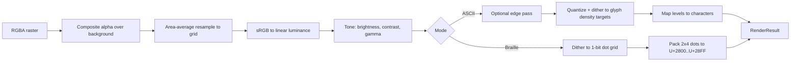

# Processing

How an image becomes ASCII or Braille output. Everything here lives in `src/core/` and is pure, DOM-free TypeScript.

## Contents

- [Pipeline](#pipeline)
- [Grid sizing](#grid-sizing)
- [Resampling](#resampling)
- [Color space and tone](#color-space-and-tone)
- [ASCII engine](#ascii-engine)
- [Braille engine](#braille-engine)
- [Dithering](#dithering)
- [Automatic threshold](#automatic-threshold)
- [Edge detection](#edge-detection)
- [Color output](#color-output)
- [Determinism](#determinism)

## Pipeline



The worker caches the output of the resample step. Changing brightness, contrast, dithering, or ramp only re-runs the steps after it.

## Grid sizing

The user sets output **columns**. Rows come from the image shape and the character shape.

`cellAspect` is the width of one character divided by the height of one line. It is measured at runtime (`measureText('M').width` against the font size times line height). Typical monospace fonts give about 0.5.

| Mode | Grid | Formula |
|---|---|---|
| ASCII | `cols × rows` | `rows = round(cols · (imgH / imgW) · cellAspect · stretchY / stretchX)` |
| Braille | dot grid `2·cols × dotRows` | `dotRows = round(2·cols · (imgH / imgW) · stretchY / stretchX)`, rounded up to a multiple of 4 |

With a cell aspect near 1:2, each Braille dot is close to square, so no extra correction is needed.

## Resampling

Large photos are reduced to the grid with an **area-average (box) filter** implemented in the worker. Each output sample is the mean of the source pixels it covers. This avoids the aliasing that browser canvas downscaling can produce at large reduction ratios, and it gives the same result on every browser.

Before this step the source is already capped to 4096 px on its longest side (see [heic-support.md](heic-support.md#limits)).

**Alpha.** Transparent pixels are composited over the chosen background before luminance is computed: black for light-on-dark output, white for dark-on-light.

## Color space and tone

1. Convert sRGB channels to **linear light**.
2. Compute luminance with Rec. 709 weights: `Y = 0.2126·R + 0.7152·G + 0.0722·B`.
3. Apply brightness, contrast, and gamma to `Y`, then clamp to `[0, 1]`.
4. Dither and quantize in linear space.

Why linear: printed dots and glyph ink average by area in linear light. Dithering in linear space makes the average brightness of a patch match the source.

**Polarity.** By default, higher luminance means higher coverage (light glyphs on a dark background). **Invert** flips this for dark-on-light output.

## ASCII engine

1. **Ramp.** A preset or a custom string, lightest to darkest.
2. **Calibration** (optional). Each candidate glyph is drawn on a canvas in the active font at a large size. Its inked-pixel fraction is its density. Densities are normalized to `[0, 1]`, sorted, and near-duplicates are dropped. The result is an array of *target intensities* cached per font and character set. This runs on the main thread because the font must be loaded there.
3. **Quantization.** Each pixel is matched to the *nearest target intensity*, not to evenly spaced levels. Real glyph densities are uneven, so this is the main reason calibrated output shades more smoothly.
4. **Dithering.** The quantization error (`value − chosenTarget`) is passed to the selected dithering method.
5. **Character mapping.** The chosen target index picks the glyph.

## Braille engine

A Braille cell packs a 2×4 block of dots into one code point: `U+2800 + bitmask`.

```text
Dot numbers          Bit values
  1  4                 0x01  0x08
  2  5                 0x02  0x10
  3  6                 0x04  0x20
  7  8                 0x40  0x80
```

Dot *n* has bit value `1 << (n − 1)`. Dots 1, 2, 3, 7 form the left column, top to bottom; dots 4, 5, 6, 8 form the right column.

**Dither first, pack second.** Each dot is on or off, so tone comes from dot density. The dot grid (`2·cols × 4·rows`) is dithered to 1 bit as a whole, then packed. Dithering per cell would stop error from crossing cell boundaries and produce visible tiling.

```ts
// src/core/braille/bitmap.ts
const DOT_BITS = [
  [0x01, 0x08],
  [0x02, 0x10],
  [0x04, 0x20],
  [0x40, 0x80],
] as const; // [row][col]

export function packBraille(
  dots: Uint8Array, dotW: number, dotH: number, fillBlank = false
): string {
  const cols = Math.ceil(dotW / 2);
  const rows = Math.ceil(dotH / 4);
  const lines: string[] = [];
  for (let cy = 0; cy < rows; cy++) {
    let line = '';
    for (let cx = 0; cx < cols; cx++) {
      let bits = 0;
      for (let r = 0; r < 4; r++) {
        for (let c = 0; c < 2; c++) {
          const x = cx * 2 + c;
          const y = cy * 4 + r;
          if (x < dotW && y < dotH && dots[y * dotW + x]) bits |= DOT_BITS[r][c];
        }
      }
      line += String.fromCharCode(0x2800 + (bits === 0 && fillBlank ? 0x04 : bits));
    }
    lines.push(line);
  }
  return lines.join('\n');
}
```

**Without dithering**, a single threshold decides each dot. It is set by hand or by Otsu's method (below).

**Blank cells.** An all-off cell is U+2800. Some apps trim it or draw it at a different width. **Fill blank cells** replaces it with U+2804 (a single dot).

## Dithering

Error-diffusion kernels are data, so adding a new one means adding an entry.

```ts
export interface Kernel {
  divisor: number;
  taps: ReadonlyArray<readonly [dx: number, dy: number, weight: number]>;
}

export const FLOYD_STEINBERG: Kernel = {
  divisor: 16,
  taps: [[1, 0, 7], [-1, 1, 3], [0, 1, 5], [1, 1, 1]],
};

export const ATKINSON: Kernel = {
  divisor: 8,
  taps: [[1, 0, 1], [2, 0, 1], [-1, 1, 1], [0, 1, 1], [1, 1, 1], [0, 2, 1]],
};

/**
 * lum: linear luminance in [0,1].
 * targets: ascending intensities. Braille uses [0, 1].
 * Returns the index of the chosen target for each pixel.
 */
export function diffuse(
  lum: Float32Array, w: number, h: number,
  targets: Float32Array, kernel: Kernel,
  strength = 1, serpentine = true
): Uint8Array {
  const out = new Uint8Array(w * h);
  const buf = Float32Array.from(lum);
  for (let y = 0; y < h; y++) {
    const ltr = !serpentine || (y & 1) === 0;
    for (let i = 0; i < w; i++) {
      const x = ltr ? i : w - 1 - i;
      const idx = y * w + x;
      const old = buf[idx];
      let q = 0, best = Infinity;
      for (let t = 0; t < targets.length; t++) {
        const d = Math.abs(old - targets[t]);
        if (d < best) { best = d; q = t; }
      }
      out[idx] = q;
      const err = (old - targets[q]) * strength;
      for (const [dx, dy, wt] of kernel.taps) {
        const nx = x + (ltr ? dx : -dx);
        const ny = y + dy;
        if (nx < 0 || nx >= w || ny >= h) continue;
        buf[ny * w + nx] += (err * wt) / kernel.divisor;
      }
    }
  }
  return out;
}
```

| Kernel | Divisor | Taps `(dx, dy, weight)` | Notes |
|---|---|---|---|
| Floyd–Steinberg | 16 | (1,0,7) (−1,1,3) (0,1,5) (1,1,1) | Passes on all error |
| Atkinson | 8 | (1,0,1) (2,0,1) (−1,1,1) (0,1,1) (1,1,1) (0,2,1) | Passes on 6/8 of the error; crisper |
| Sierra Lite | 4 | (1,0,2) (−1,1,1) (0,1,1) | Fast, light |
| Burkes | 32 | (1,0,8) (2,0,4) (−2,1,2) (−1,1,4) (0,1,8) (1,1,4) (2,1,2) | Smooth |

**Ordered dithering.** Each pixel is compared to a tiled Bayer matrix (2×2, 4×4, or 8×8) scaled to the spacing between target levels. It has no error state, so results are stable and each pixel can be computed independently.

**Blue noise.** Same as ordered, but the threshold texture is a precomputed blue-noise tile, which avoids visible repeating structure.

**Strength** scales the propagated error (0–1). **Serpentine** scanning alternates direction each row to reduce streaking.

## Automatic threshold

Used for Braille (and ASCII) when dithering is off and **Auto** is selected. Otsu's method:

1. Build a 256-bin histogram of luminance (after tone adjustments, converted back to 8-bit).
2. For each candidate threshold `t`, split the histogram into a dark class and a light class.
3. Choose the `t` that maximizes the variance between the two classes.

## Edge detection

ASCII mode only.

1. Apply the Sobel operator to the luminance grid to get horizontal and vertical gradients `Gx` and `Gy`.
2. Magnitude is `sqrt(Gx² + Gy²)`; direction is `atan2(Gy, Gx)`.
3. Where magnitude is above the user threshold, replace the shading glyph with a directional one. The edge direction is perpendicular to the gradient, quantized into four bins: `-`, `/`, `|`, `\`.

## Color output

Color is computed on a separate grid: the mean RGB of the source pixels behind each cell (for Braille, the 2×4 block). To keep the DOM small:

- Adjacent cells with the same quantized color are merged into one `<span>`.
- For large outputs, the canvas renderer is used instead of spans.

## Determinism

Given the same pixels and settings, every function here returns the same result. There is no randomness (blue noise uses a fixed tile) and no dependence on the browser's canvas scaling. Snapshot tests rely on this (see [testing.md](testing.md)).
