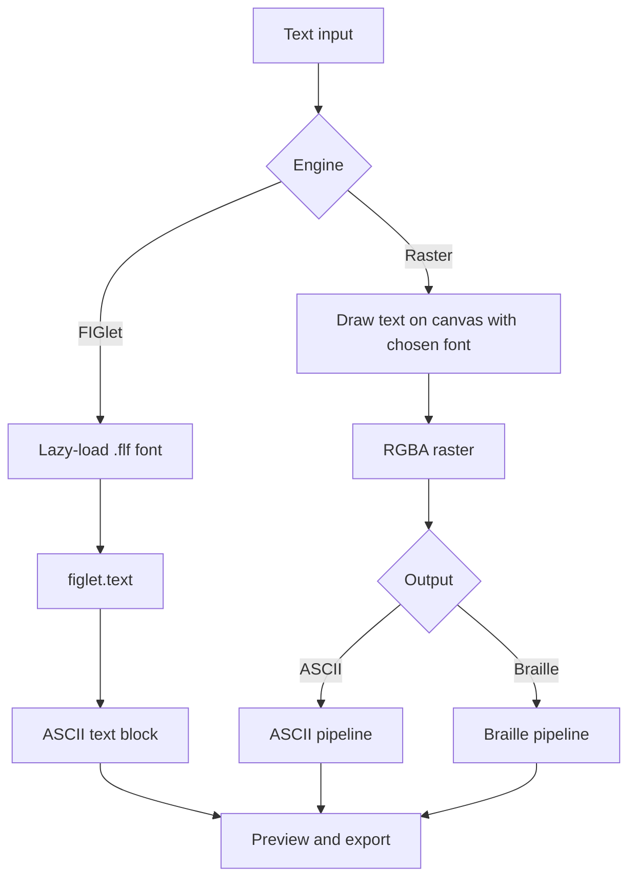

# Text Mode

How typed text becomes ASCII or Braille art. There are two engines and two outputs.

## Contents

- [Overview](#overview)
- [FIGlet engine](#figlet-engine)
- [Raster engine](#raster-engine)
- [Text to Braille](#text-to-braille)
- [Gradients](#gradients)
- [Fonts and licensing](#fonts-and-licensing)
- [Settings](#settings)

## Overview

| Engine | ASCII output | Braille output | Best for |
|---|---|---|---|
| **FIGlet** | Yes | No | Classic banner letters, README headers |
| **Raster** | Yes | Yes | Any font, shaded or outlined lettering, compact Braille text |



Choosing Braille output selects the Raster engine automatically.

## FIGlet engine

FIGlet fonts describe how each letter is drawn from characters. The app ships a large catalog and loads a font only when the user selects it.

**Font files.** `.flf` files live in `public/fonts/figlet/`. A manifest, `figlet-fonts.json`, lists each font:

```json
{
  "name": "ANSI Shadow",
  "category": "3D and Shadow",
  "file": "ANSI Shadow.flf",
  "bytes": 12345
}
```

**Categories** shown in the font picker: Popular, 3D and Shadow, Bold and Block, Futuristic, Stylized, Isometric, Novelty, All.

**Rendering.**

```ts
// src/core/text/figlet.ts
import figlet from 'figlet';

type Layout = 'default' | 'full' | 'fitted' | 'controlled smushing' | 'universal smushing';
const loaded = new Set<string>();

export async function renderFiglet(text: string, font: string, layout: Layout): Promise<string> {
  if (!loaded.has(font)) {
    const res = await fetch(`/fonts/figlet/${encodeURIComponent(font)}.flf`);
    if (!res.ok) throw new Error(`font-not-found: ${font}`);
    figlet.parseFont(font, await res.text());
    loaded.add(font);
  }
  return figlet.text(text, { font, horizontalLayout: layout });
}
```

Check the exact `figlet` API (`parseFont`, promise-returning `text`) against the installed version.

**Options.**

| Option | Values |
|---|---|
| Font | Any font in the manifest |
| Layout | default, full, fitted, controlled smushing, universal smushing |
| Alignment | left, center, right |
| Wrap width | Characters per line; long text wraps at word boundaries |
| Gradient | Optional two-color gradient |

*Layout* controls how much neighboring letters are allowed to overlap. *Full* keeps full spacing; *smushing* modes merge touching parts.

## Raster engine

The raster engine draws the text to a canvas, then feeds the pixels into the same pipeline used for images. This is what allows shaded lettering, outlines, shadows, and Braille.

```ts
// src/core/text/rasterText.ts
export interface RasterTextOptions {
  text: string;
  fontFamily: string;
  fontWeight: number;
  fontSizePx: number;    // raster size, not visual size (default 96)
  lineHeight: number;    // multiplier, default 1.2
  align: 'left' | 'center' | 'right';
  paddingPx: number;     // default 16
}

export async function rasterizeText(o: RasterTextOptions): Promise<RasterImage> {
  const font = `${o.fontWeight} ${o.fontSizePx}px "${o.fontFamily}"`;
  await document.fonts.load(font); // wait for the font before measuring

  const lines = o.text.split('\n');
  const probe = new OffscreenCanvas(1, 1).getContext('2d')!;
  probe.font = font;
  const widths = lines.map(l => probe.measureText(l).width);
  const lineH = o.fontSizePx * o.lineHeight;

  const w = Math.ceil(Math.max(...widths)) + o.paddingPx * 2;
  const h = Math.ceil(lines.length * lineH) + o.paddingPx * 2;

  const canvas = new OffscreenCanvas(w, h);
  const g = canvas.getContext('2d', { willReadFrequently: true })!;
  g.fillStyle = '#000';
  g.fillRect(0, 0, w, h);
  g.font = font;
  g.textBaseline = 'top';
  g.fillStyle = '#fff';

  lines.forEach((line, i) => {
    const free = w - o.paddingPx * 2 - widths[i];
    const x = o.paddingPx + (o.align === 'center' ? free / 2 : o.align === 'right' ? free : 0);
    g.fillText(line, x, o.paddingPx + i * lineH);
  });

  return { width: w, height: h, data: g.getImageData(0, 0, w, h).data };
}
```

**How size works.** The canvas is cropped to the text plus padding, then reduced to the requested number of output **columns**. So the column count decides how wide the result is; `fontSizePx` only sets the resolution of the intermediate raster. Keep it high (at least 4 times the target dot width) so the reduction looks clean.

**Effects.**

| Effect | Description |
|---|---|
| Outline | Stroke drawn around glyphs before conversion |
| Shadow | Offset, blurred copy behind the text |

**Why main thread.** Fonts are loaded on the main thread, so rasterization happens there. The resulting buffer is transferred to the pipeline worker.

**Fonts.** A curated set of open-license fonts is self-hosted under `public/fonts/ui/` and loaded with the `FontFace` API. Self-hosting keeps the app free of third-party requests.

## Text to Braille

Text goes through the Raster engine, then through the Braille pipeline described in [processing.md](processing.md#braille-engine).

Braille text stays legible at small sizes. Each character carries a 2×4 dot grid, so lettering that needs 30 or more columns as FIGlet output can fit in a fraction of that.

Recommended starting settings:

| Setting | Value | Reason |
|---|---|---|
| Weight | Bold (600–800) | Thicker strokes survive the 1-bit conversion |
| Dithering | None or Atkinson | Keeps letter edges crisp |
| Threshold | Auto | Works for white-on-black text |
| Fill blank cells | On, if pasting into chat apps | Avoids collapsed blank patterns |

Multi-line text is laid out on one canvas and converted as one image, so line spacing is preserved.

## Gradients

A two-color linear gradient (horizontal or vertical) is applied by interpolating color across the output. It appears in the preview and PNG export. Plain-text exports do not contain color.

## Fonts and licensing

- FIGlet fonts are each licensed by their authors. Review every bundled `.flf` file before redistribution and record attribution in `THIRD_PARTY_NOTICES.md`.
- UI fonts for the Raster engine must be open-license (for example SIL Open Font License). Store license files next to the font files.
- Do not load fonts from third-party CDNs.

## Settings

```ts
export type TextSettings =
  | {
      engine: 'figlet';
      text: string;
      font: string;
      layout: 'default' | 'full' | 'fitted' | 'controlled smushing' | 'universal smushing';
      align: 'left' | 'center' | 'right';
      maxWidth: number;
      gradient?: { from: string; to: string; direction: 'horizontal' | 'vertical' };
    }
  | {
      engine: 'raster';
      text: string;
      fontFamily: string;
      fontWeight: number;
      fontSizePx: number;
      lineHeight: number;
      align: 'left' | 'center' | 'right';
      effects?: { outlinePx?: number; shadow?: { dx: number; dy: number; blur: number } };
      output: AsciiSettings | BrailleSettings; // see architecture.md
    };
```
